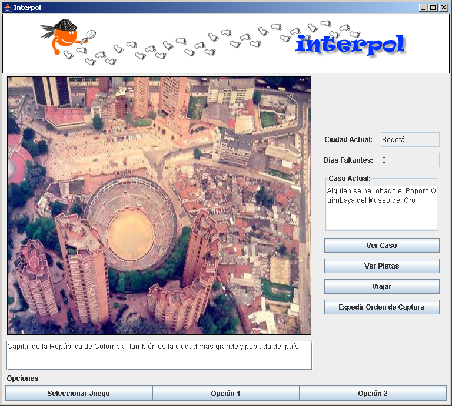

# Enunciado

Se desea desarrollar un juego en el cual ha ocurrido un crimen y es 
necesario que el usuario persiga al ladrón por varias ciudades del mundo, 
basándose en pistas que se encuentran en diferentes lugares de las 
ciudades visitadas.

Para capturar al ladrón, se tiene que tener en cuenta el tiempo. Hay un 
límite de tiempo dado en días y en caso que el tiempo especificado en el 
juego se acabe, el ladrón habrá escapado. Así, cada vez que se consulte 
un lugar de la ciudad, va a costar tiempo (especificado para cada lugar). 

Adicionalmente, cada vez que se quiere viajar de una ciudad a otra 
también va a costar tiempo.

Se tiene una lista de sospechosos, de los cuales sólo uno de ellos es el 
ladrón. Para poder atrapar al ladrón es necesario hacer dos cosas:

1. Encontrar la ciudad donde está el sospechoso siguiendo las pistas 
dadas.
2. Generar la orden de captura del sospechoso de acuerdo a las pistas que 
se encuentran en los lugares, antes de haber encontrado la ciudad.

En caso que el tiempo dado acabe, o se llegue a una ciudad de la cual no 
se puede viajar a otra, o se encuentre el sospechoso pero no se genere la 
orden de captura, el juego termina y el usuario pierde.

Para ganar en el juego, el usuario debe haber generado la orden de 
captura correctamente y encontrar la ciudad donde se encuentra el ladrón.

En caso que se genere una orden de captura para un sospechoso incorrecto 
el juego termina y el usuario pierde.

Ya que se piensa utilizar un árbol para estructurar la aplicación, se 
pretende conocer cierta información acerca de él:

- Peso
- Altura
- Recorrido Preorden
- Recorrido Postorden
- Recorrido Inorden

# Interfaz

	Se muestra la ciudad donde todo comienza

	Se tiene una lista de sospechosos posibles
